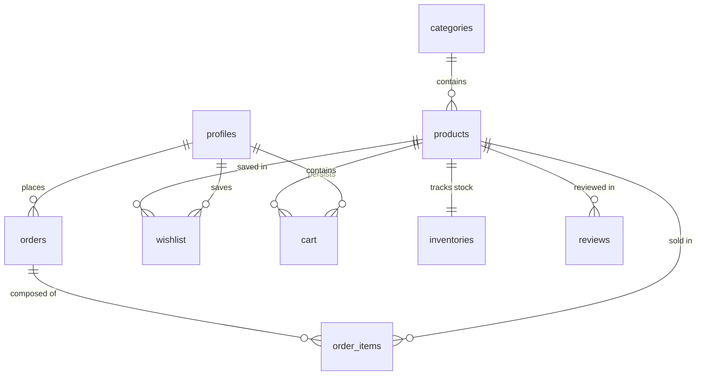

# APEX_GEAR // PRODUCT REQUIREMENTS DOCUMENT
## Futuristic 3D Sports Accessories E-Commerce Platform

---

## 1. PRODUCT VISION & BRAND DIRECTION

### 1.1 Product Vision
**APEX_GEAR** is a world-class, premium, cinematic 3D e-commerce storefront showcasing next-generation, high-performance athletic gear and accessories. Drawing inspiration from high-concept brands like Tesla, Apple, Nike, and Awwwards-winning immersive interfaces, APEX_GEAR merges high-end hardware, fluid web animation, and interactive 3D rendering to create a luxurious and performance-driven digital retail experience.

### 1.2 Brand Direction & Visual Aesthetic
We will move away from standard grid-based templates into a high-depth, immersive "dark-luxury cyberpunk" interface.
*   **Aesthetic System**: Cybernetic Luxury / High-Performance Hardware.
*   **Color Palette**:
    *   **Backgrounds**: Pitch Black (`#030303`) and Deep Obscure Space (`#09090b`).
    *   **Accents**: Neon Cyan (`#00F2FE`), Laser Orange/Red (`#FF4B2B`), and Electric Violet (`#7000FF`).
    *   **Surfaces**: Semi-transparent dark chrome layers with micro-borders, heavy backdrop-blur (glassmorphism), and radial ambient glowing meshes.
*   **Typography**:
    *   **Headings**: Space Grotesk / Orbitron / Syne (Futuristic, high-width tech fonts).
    *   **Body**: Inter / Outfit (Ultra-clean, highly legible geometric sans-serif).
*   **Visual Enhancements**: Subtle particle dust fields, chrome dynamic reflections, glowing indicators, animated hover magnetic cards, and volumetric lighting shadows.

---

## 2. USER EXPERIENCE GOALS & ACCESSIBILITY

### 2.1 User Experience Goals
*   **Cinematic Pacing**: A smooth, customized preloader that transitions seamlessly into a full hero splash, complete with camera fly-throughs.
*   **Zero Stutter (Liquid Motion)**: Integrate Lenis or GSAP ScrollSmoother to implement smooth deceleration on scrolling, ensuring that visual storytelling and scroll-bound animations react dynamically to user input without framerate drops.
*   **Tactile 3D Feedback**: Products are not flat images; they are live 3D assets that tilt, rotate, and illuminate dynamically based on cursor movement and section scroll positions.
*   **Frictionless Transaction**: Cart, Wishlist, and Checkout transitions occur in-place or via sliding futuristic overlays, eliminating full-page flashes.

### 2.2 Accessibility & SEO Considerations
*   **Accessibility (a11y)**:
    *   Keyboard navigation overrides for the 3D scene controls.
    *   Screen-reader fallback descriptions for all 3D canvas assets (`aria-label`, alternate text elements).
    *   Maintain strict contrast ratios for text overlays using tailwind borders and readable backing overlays.
    *   Focus traps inside glassmorphic overlays and modals.
*   **SEO Optimization**:
    *   Pre-rendering meta-tags for key products.
    *   Semantic markup (`<main>`, `<section>`, `<article>`, `<h1>`-`<h6>` hierarchy).
    *   Optimized image fallbacks for standard web crawlers (dynamic Open Graph images).
    *   Structured JSON-LD schema markup for e-commerce products, ratings, prices, and stock statuses.

---

## 3. FULL FEATURE LIST & PAGE BREAKDOWN

### 3.1 Core Customer Features
1.  **Immersive Hero Landing Page**:
    *   Interactive 3D product hero rotating relative to the mouse cursor.
    *   Infinite marquees displaying brand slogans ("PRECISE FLOW // ZERO LIMITS").
    *   Storytelling sections utilizing ScrollTrigger for camera movement through 3D meshes.
2.  **Futuristic Product Catalog**:
    *   Advanced glass-card product cards featuring real-time interactive 3D previews.
    *   Search and dynamic sidebar filters (Category, Price Range, In-Stock, Performance Metric).
    *   Toggle display for standard grid view vs. Immersive Cinematic Carousel.
3.  **Cinematic Product Detail Page (PDP)**:
    *   Full-page interactive 3D model viewer with customize/color-change switches.
    *   Volumetric lighting controller to rotate lights on the model.
    *   Interactive hot-spots revealing structural tech specs (e.g., "Carbon Fiber Tension Plate", "Neural Sync Core").
    *   Standardized add-to-cart, real-time inventory checks, and wishlist toggle.
4.  **Persistent Shopping Cart**:
    *   Persistent side-drawer with slide-in animations.
    *   Real-time quantity adjusting and automated price calculations.
    *   Persistence synced dynamically via Supabase User Cart table.
5.  **Futuristic Checkout Overlay & Razorpay UPI Integration**:
    *   Unified Checkout screen with an embedded mock Razorpay payment processing terminal.
    *   Dynamic transaction feedback (Pending / Successful / Failed) styled as a hologram interface.
6.  **Customer Hub (Auth & Profile)**:
    *   Sign Up / Sign In via glassmorphic overlays.
    *   Order Tracking visual dashboard displaying progress bar (Processing → Built → Dispatched → Delivered).
    *   Customer Wishlist displaying saved cyberpunk accessories.

### 3.2 Advanced Admin Dashboard Features
1.  **Inventory Control Center**:
    *   Real-time stock adjustment inputs showing raw counts (hidden from standard customers).
    *   "Out of Stock" override switches.
    *   Automated notification indicator when items fall below a threshold.
2.  **Product & Asset Manager**:
    *   Create, Read, Update, and Delete (CRUD) controls for accessories.
    *   Drag-and-drop file uploader (for images and 3D `.glb` assets) hooked directly into Supabase Storage.
    *   Category creator with performance-metric assignments.
3.  **Global Order Control Panel**:
    *   Review all placed client orders.
    *   Dropdown triggers to alter order statuses (Processing, Shipped, Delivered, Cancelled).
    *   Real-time revenue graph and total units sold dashboards.

---

## 4. WEBSITE ARCHITECTURE & FILE DIRECTORY

We will organize the code using a clean, scalable React structure inside Vite:

```
src/
├── assets/                  # Fonts, static textures, noise shaders
├── components/
│   ├── 3d/                  # 3D Scene components, Particle Systems, Model viewports
│   │   ├── BrandBg.tsx      # Particles / Neon mesh background
│   │   ├── ModelViewer.tsx  # Dynamic GLB viewer with controls
│   │   └── FloatingItems.tsx# Scattered floating micro-items
│   ├── admin/               # Admin panel specific modules
│   ├── cart/                # Drawer, cart items
│   ├── ui/                  # Reusable glassmorphic UI elements (Button, Card, Input)
│   └── layout/              # Navbar, Footer, Transition wrappers
├── context/                 # Auth, Cart, UI state providers
├── hooks/                   # Custom business logic (useCart, useSupabase, etc.)
├── pages/
│   ├── Home.tsx             # Interactive Cinematic Hero
│   ├── Store.tsx            # Filterable product catalog
│   ├── ProductDetail.tsx    # Technical 3D spec sheet and purchase page
│   ├── AdminDashboard.tsx   # Product management and inventory controls
│   ├── Checkout.tsx         # Futuristic payment portal
│   └── Profile.tsx          # Order tracking & account settings
├── router/                  # React Router / TanStack router routing
├── styles/                  # Tailwind custom configurations and noise shaders
├── supabase/                # Clients, connection setup
└── types/                   # TypeScript interfaces (Product, Order, Inventory)
```

---

## 5. ANIMATION & 3D INTERACTION STRATEGY

### 5.1 3D Interaction Architecture (Three.js / React Three Fiber / Drei)
*   **Scene 1: Main Hero background**: Scattered particle system with a dynamic vortex shader. A large signature 3D accessory (e.g., carbon futuristic helmet or magnetic wrist-blade) rotates elegantly at the screen's center, reacting slightly to the mouse pointer's X/Y coords via a lerp function:
    ```javascript
    // Smooth mouse follow logic inside R3F useFrame
    state.camera.position.x = THREE.MathUtils.lerp(state.camera.position.x, mouse.x * 2, 0.05);
    state.camera.position.y = THREE.MathUtils.lerp(state.camera.position.y, mouse.y * 2, 0.05);
    state.camera.lookAt(0, 0, 0);
    ```
*   **Scene 2: Spec Viewer**: Dynamic lighting rig comprising directional spot lights projecting neon hues. Double-clicking models creates a camera zoom animation using GSAP to focus on dynamic hot-spots.
*   **Optimized Loading**: We will use Drei's `<Preload all />` along with `<Suspense>` loaders and compressed `.glb` models run through gltf-pipeline (using Draco compression) to keep assets small (<2MB per model).

### 5.2 Dynamic Animation System (GSAP & Framer Motion)
*   **Smooth Scrolling**: Lenis integration for unified momentum scrolling across all browsers.
*   **ScrollTrigger Storytelling**: As the user scrolls down the landing page, the 3D model will smoothly fly to the left side, allowing tech specs to slide in on the right, then spin rapidly to display a secondary angle as the CTA section is reached.
*   **Page Transitions**: Framer Motion custom layout switches with glass overlay swipes and text-stagger reveal triggers.
*   **Interactive Cursor**: A customized neon ring cursor that expands, changes colors, and magnetic-snaps when hovering over buttons, links, and 3D hotspots.

---

## 6. BACKEND ARCHITECTURE & SUPABASE SCHEMA PLANNING

We will configure a highly secure, real-time database schema in Supabase with RLS (Row Level Security) and active triggers.



### 6.1 Database Schema Definition (SQL)

```sql
-- ENABLE EXTENSIONS
CREATE EXTENSION IF NOT EXISTS "uuid-ossp";

-- 1. USERS PROFILE TABLE
CREATE TABLE public.profiles (
    id UUID REFERENCES auth.users ON DELETE CASCADE PRIMARY KEY,
    email TEXT UNIQUE NOT NULL,
    full_name TEXT,
    avatar_url TEXT,
    role TEXT DEFAULT 'customer' CHECK (role IN ('customer', 'admin')),
    created_at TIMESTAMP WITH TIME ZONE DEFAULT timezone('utc'::text, now()) NOT NULL,
    updated_at TIMESTAMP WITH TIME ZONE DEFAULT timezone('utc'::text, now()) NOT NULL
);

-- 2. CATEGORIES TABLE
CREATE TABLE public.categories (
    id UUID DEFAULT uuid_generate_v4() PRIMARY KEY,
    name TEXT NOT NULL UNIQUE,
    slug TEXT NOT NULL UNIQUE,
    description TEXT,
    icon TEXT, -- Lucide Icon name
    created_at TIMESTAMP WITH TIME ZONE DEFAULT timezone('utc'::text, now()) NOT NULL
);

-- 3. PRODUCTS TABLE
CREATE TABLE public.products (
    id UUID DEFAULT uuid_generate_v4() PRIMARY KEY,
    name TEXT NOT NULL,
    slug TEXT UNIQUE NOT NULL,
    description TEXT,
    detailed_spec JSONB, -- Spec key-values
    price DECIMAL(12, 2) NOT NULL CHECK (price >= 0),
    image_urls TEXT[] DEFAULT '{}',
    model_3d_url TEXT, -- Path to GLB file in Supabase Storage
    category_id UUID REFERENCES public.categories(id) ON DELETE SET NULL,
    is_featured BOOLEAN DEFAULT false,
    created_at TIMESTAMP WITH TIME ZONE DEFAULT timezone('utc'::text, now()) NOT NULL,
    updated_at TIMESTAMP WITH TIME ZONE DEFAULT timezone('utc'::text, now()) NOT NULL
);

-- 4. INVENTORIES TABLE (Private counts, associated 1-to-1)
CREATE TABLE public.inventories (
    id UUID DEFAULT uuid_generate_v4() PRIMARY KEY,
    product_id UUID REFERENCES public.products(id) ON DELETE CASCADE UNIQUE NOT NULL,
    stock_count INT NOT NULL DEFAULT 0 CHECK (stock_count >= 0),
    restock_threshold INT NOT NULL DEFAULT 5,
    updated_at TIMESTAMP WITH TIME ZONE DEFAULT timezone('utc'::text, now()) NOT NULL
);

-- 5. CART TABLE (Persistent)
CREATE TABLE public.cart (
    id UUID DEFAULT uuid_generate_v4() PRIMARY KEY,
    user_id UUID REFERENCES public.profiles(id) ON DELETE CASCADE NOT NULL,
    product_id UUID REFERENCES public.products(id) ON DELETE CASCADE NOT NULL,
    quantity INT NOT NULL DEFAULT 1 CHECK (quantity > 0),
    UNIQUE(user_id, product_id)
);

-- 6. WISHLIST TABLE
CREATE TABLE public.wishlist (
    id UUID DEFAULT uuid_generate_v4() PRIMARY KEY,
    user_id UUID REFERENCES public.profiles(id) ON DELETE CASCADE NOT NULL,
    product_id UUID REFERENCES public.products(id) ON DELETE CASCADE NOT NULL,
    created_at TIMESTAMP WITH TIME ZONE DEFAULT timezone('utc'::text, now()) NOT NULL,
    UNIQUE(user_id, product_id)
);

-- 7. ORDERS TABLE
CREATE TABLE public.orders (
    id UUID DEFAULT uuid_generate_v4() PRIMARY KEY,
    user_id UUID REFERENCES public.profiles(id) ON DELETE SET NULL,
    status TEXT NOT NULL DEFAULT 'processing' CHECK (status IN ('processing', 'built', 'dispatched', 'delivered', 'cancelled')),
    total_amount DECIMAL(12, 2) NOT NULL,
    payment_method TEXT NOT NULL DEFAULT 'UPI',
    payment_id TEXT, -- Razorpay ID
    payment_status TEXT NOT NULL DEFAULT 'pending' CHECK (payment_status IN ('pending', 'completed', 'failed')),
    shipping_address JSONB NOT NULL,
    created_at TIMESTAMP WITH TIME ZONE DEFAULT timezone('utc'::text, now()) NOT NULL,
    updated_at TIMESTAMP WITH TIME ZONE DEFAULT timezone('utc'::text, now()) NOT NULL
);

-- 8. ORDER ITEMS TABLE
CREATE TABLE public.order_items (
    id UUID DEFAULT uuid_generate_v4() PRIMARY KEY,
    order_id UUID REFERENCES public.orders(id) ON DELETE CASCADE NOT NULL,
    product_id UUID REFERENCES public.products(id) ON DELETE SET NULL,
    quantity INT NOT NULL CHECK (quantity > 0),
    price_at_purchase DECIMAL(12, 2) NOT NULL
);

-- 9. REVIEWS TABLE
CREATE TABLE public.reviews (
    id UUID DEFAULT uuid_generate_v4() PRIMARY KEY,
    product_id UUID REFERENCES public.products(id) ON DELETE CASCADE NOT NULL,
    user_id UUID REFERENCES public.profiles(id) ON DELETE CASCADE NOT NULL,
    rating INT NOT NULL CHECK (rating >= 1 AND rating <= 5),
    comment TEXT,
    created_at TIMESTAMP WITH TIME ZONE DEFAULT timezone('utc'::text, now()) NOT NULL,
    UNIQUE(product_id, user_id)
);
```

### 6.2 Row-Level Security (RLS) Policies
*   **Profiles**:
    *   Read: Authenticated users can view their own profile. Admins can view all.
    *   Write: Users can update their own data.
*   **Products / Categories / Reviews**:
    *   Read: Public access (anyone can browse items).
    *   Write: Restricted entirely to authenticated accounts with `role = 'admin'`.
*   **Inventories**:
    *   Read: Restricted to admins only. Regular users cannot fetch database inventory records (stock check is computed and returned strictly as an availability boolean or through public wrapper view).
    *   Write: Strictly `admin` only.
*   **Orders / Cart / Wishlist**:
    *   Read & Write: Authenticated users can only read and write their own matching UUID records.

---

## 7. INVENTORY MANAGEMENT LOGIC & CONTROLS

### 7.1 Strict Customer Visibility Rules
*   To prevent competitive parsing and support high-end branding, the exact stock count (e.g., `stock_count: 14`) **must never be returned to customers**.
*   **Product API Interface**:
    *   When querying products, the storefront will call a database function or secure query that resolves availability into a virtual boolean: `is_purchasable = (stock_count > 0)`.
    *   If `is_purchasable` is `true`, show standard purchase buttons.
    *   If `is_purchasable` is `false`, the product automatically displays **"Out of Stock"** in a holographic orange badge and disables the cart insertion hooks.

### 7.2 Strict Transaction Security (Race Conditions)
To prevent customers from buying products that have gone out of stock between the moment they add it to their cart and execute checkout, we will enforce a database function for checkout that runs in a transaction block.

```sql
CREATE OR REPLACE FUNCTION process_checkout(
    p_user_id UUID,
    p_shipping_address JSONB,
    p_payment_id TEXT,
    p_payment_method TEXT
) RETURNS UUID AS $$
DECLARE
    v_order_id UUID;
    v_cart_item RECORD;
    v_stock INT;
BEGIN
    -- 1. Create order record
    INSERT INTO public.orders (user_id, total_amount, shipping_address, payment_id, payment_method, payment_status, status)
    VALUES (
        p_user_id,
        (SELECT SUM(c.quantity * p.price) FROM public.cart c JOIN public.products p ON c.product_id = p.id WHERE c.user_id = p_user_id),
        p_shipping_address,
        p_payment_id,
        p_payment_method,
        'completed',
        'processing'
    ) RETURNING id INTO v_order_id;

    -- 2. Loop through cart items, check stock, lock rows
    FOR v_cart_item IN (SELECT c.product_id, c.quantity, p.name, p.price FROM public.cart c JOIN public.products p ON c.product_id = p.id WHERE c.user_id = p_user_id) LOOP
        -- Select stock with FOR UPDATE lock
        SELECT stock_count INTO v_stock 
        FROM public.inventories 
        WHERE product_id = v_cart_item.product_id 
        FOR UPDATE;

        IF v_stock < v_cart_item.quantity THEN
            RAISE EXCEPTION 'Product % is out of stock.', v_cart_item.name;
        END IF;

        -- Deduct Stock
        UPDATE public.inventories 
        SET stock_count = stock_count - v_cart_item.quantity 
        WHERE product_id = v_cart_item.product_id;

        -- Write Order Item
        INSERT INTO public.order_items (order_id, product_id, quantity, price_at_purchase)
        VALUES (v_order_id, v_cart_item.product_id, v_cart_item.quantity, v_cart_item.price);
    END LOOP;

    -- 3. Clear customer cart
    DELETE FROM public.cart WHERE user_id = p_user_id;

    RETURN v_order_id;
END;
$$ LANGUAGE plpgsql SECURITY DEFINER;
```

---

## 8. DEPLOYMENT & SCALABILITY PLAN

*   **Hosting**: Frontend hosted on Vercel with automatic edge-network caching and global CDN delivery.
*   **3D Assets Hosting**: GLB models and multi-spectral textures are kept in public Supabase Storage buckets, optimized using GZip compression.
*   **Scale Plan**:
    *   Implement client-side memoization (`React.memo`, `useMemo`, `useCallback`) to bypass re-renders on the canvas.
    *   Transition database to read-replicas once write volumes spike.
    *   Use Edge Functions to interact with Stripe / Razorpay gateways directly, removing server round-trips.

---

## 9. NEXT STEPS & APPROVAL CHECKPOINT

We are ready to begin implementation of the codebase. Below is our phased roadmap:

```
[Phase 1: PRD Approved] ➔ [Phase 2: Project Init & Supabase Migrations] ➔ [Phase 3: Core 3D Scenes & Animations] ➔ [Phase 4: Storefront & Admin Logic] ➔ [Phase 5: Payments & Production Audit]
```

### Please review this PRD. Once you approve, we will immediately initiate the project setup and execute the database tables.
